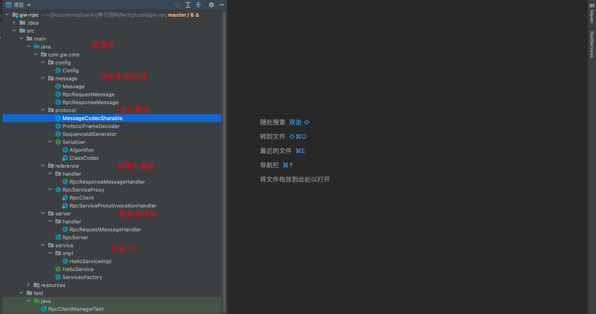
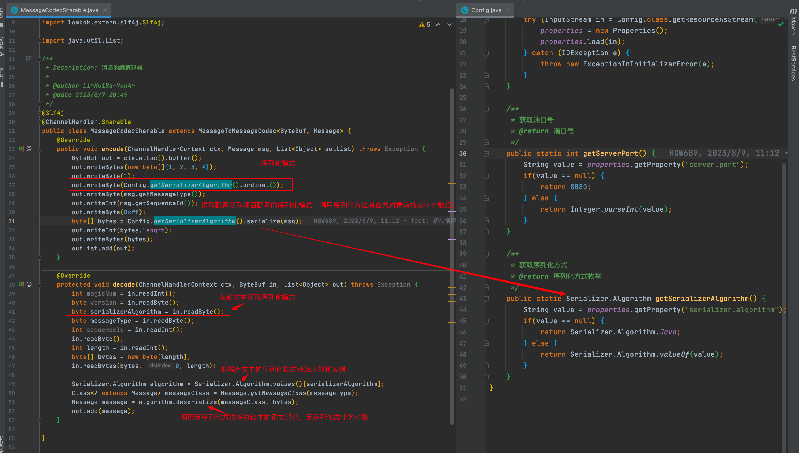
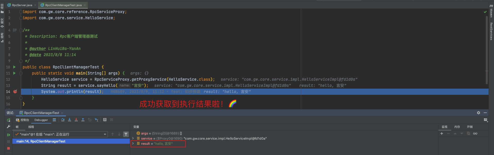

# 基于 Netty 的简易版 RPC需求分析
随着分布式和微服务的盛行，给我们的项目带来的收益是不同模块间的解耦，从而使整个软件开发流程更加的灵活。同时，模块间的调用是稀松平常的事情。这就会出现一系列的新的需求：

- 不同的模块有可能是分布在不同的机器上，要想相互调用一定会涉及到网络传输，所以要有相应的`通信模块`。
- 其次，网络传输的数据是二进制流。而在面向对象的程序中，业务处理的是对象，这就需要发送方在网络发送之前把对象`序列化`成二进制流，同时网络接收方收到二进制流后需要把二进制流`反序列化`成对象。
- 同时，为了让调用方调用远程服务像调用本地方法一样简单，需要对网络请求、序列化做封装，Java 中一般采用`动态代理`去实现。
- 还有，要有`注册中心`提供服务方的地址列表，同时出现了新的服务节点需要注册中心及时发现，这样调用方才能找到合适的服务方。
- 最后，还需要负载均衡、熔断、降级、心跳探活等功能。

本篇博文中只讲解一个简化版的 RPC 设计，注册中心和负载均衡，及心跳探活等功能就不讲了……


> 捋了捋，大致流程如下

1. 首先，客户端通过`动态代理模块`获取代理实例。
2. 接下来，客户端通过`动态代理模块` 来调用动态代理方法，用来实现封装 RpcRequestMessage 对象，把要调用的服务和方法，以及方法参数准备通过网络请求发送出去。
3. 在发送之前通过编码模块转换`对象序列化`为字节数组。
4. `动态代理`随后会通过网络通信把序列化成字节数组的请求发送给服务端，同时客户端同步或异步等待服务端的响应。这些工作都由动态代理完成，`对于调用方来说是无感的`。
5. 服务端收到客户端的请求后，把字节数组`反序列化`成业务对象。
6. 服务端根据请求中要调用的类和方法，通过反射实例化类并找到对应的方法。
7. 服务端用收到的参数调用本地方法后封装响应对象。
8. 把响应对象序列化为字符数组。
9. 服务端把序列化的响应对象通过网络返回给客户端。
10. 客户端收到序列化成字节数组的响应后`反序列化成响应对象`。

# 简易RPC框架的整体实现
我们的 RPC 项目主要分为下面几个模块，结构非常清晰：

配套的源码源代码地址：[gw-rpc](https://gitee.com/hgw689/gw-rpc) 。 主要分为以下几个基本模块。

`协议模块`：设计了通信请求体、响应体，序列化模式。

`服务工厂`：通过map维护接口类和实现类的映射关系。

`服务调用方模块`：实现了服务调用方的基本功能，同时包含了**动态代理**的功能实现。

`服务提供方模块`：实现了服务提供方的基本功能。

<br/>

## 协议模块 📖
### 自定义协议 🆕

关于协议模块拆分至另外一篇博文进行讲解，[使用Netty进行协议开发：多协议支持与自定义协议的实现](https://blog.csdn.net/m0_49183244/article/details/133102864?spm=1001.2014.3001.5501)。
### 序列化方式 🔢
对于RPC来说，序列化是一个必不可少的过程，它将业务对象以字节数组的形式在网络中进行传输。为了实现序列化功能，通常定义一个序列化接口，其中包含序列化方法和反序列化方法。在实际应用中，提供几种常见的序列化方式可供选择，包括以下几种：

1. Java JDK 自带的序列化：Java 提供了默认的序列化机制，通过ObjectInputStream和ObjectOutputStream实现。对象可以以二进制形式进行序列化和反序列化。这种方式简单易用，但存在一些性能和版本兼容性的问题。
2. Json算法使用Gson库将对象转换为JSON字符串，并通过JSON字符串进行序列化和反序列化操作。
3. Hessian算法使用Hessian库将对象序列化为字节数组，提供了更高的性能和较小的序列化结果。


```java
  /**
   * Description: 序列化
   *
   * @author LinHuiBa-YanAn
   * @date 2023/8/7 20:32
   */
  public interface Serializer {
      /**
       * 反序列化方法
       *
       * @param clazz 类型
       * @param bytes 字节码
       * @param <T>   类型
       * @return 对象
       */
      <T> T deserialize(Class<T> clazz, byte[] bytes);

      /**
       * 序列化方法
       *
       * @param object 对象
       * @param <T>    类型
       * @return byte[]
       */
      <T> byte[] serialize(T object);

      enum Algorithm implements Serializer {

          Java {
              @Override
              public <T> T deserialize(Class<T> clazz, byte[] bytes) {
                  try {
                      ObjectInputStream ois = new ObjectInputStream(new ByteArrayInputStream(bytes));
                      return (T) ois.readObject();
                  } catch (IOException | ClassNotFoundException e) {
                      throw new RuntimeException("反序列化失败", e);
                  }
              }

              @Override
              public <T> byte[] serialize(T object) {
                  try {
                      ByteArrayOutputStream bos = new ByteArrayOutputStream();
                      ObjectOutputStream oos = new ObjectOutputStream(bos);
                      oos.writeObject(object);
                      return bos.toByteArray();
                  } catch (IOException e) {
                      throw new RuntimeException("序列化失败", e);
                  }
              }
          },

          Json {
              @Override
              public <T> T deserialize(Class<T> clazz, byte[] bytes) {
                  Gson gson = new GsonBuilder().registerTypeAdapter(Class.class, new ClassCodec()).create();
                  String json = new String(bytes, StandardCharsets.UTF_8);
                  return gson.fromJson(json, clazz);
              }

              @Override
              public <T> byte[] serialize(T object) {
                  Gson gson = new GsonBuilder().registerTypeAdapter(Class.class, new ClassCodec()).create();
                  String json = gson.toJson(object);
                  return json.getBytes(StandardCharsets.UTF_8);
              }
          },

          Hessian {
              @Override
              public <T> T deserialize(Class<T> clazz, byte[] bytes) {
                  ByteArrayInputStream byteArrayInputStream =  new ByteArrayInputStream(bytes);
                  HessianInput hessianInput = new HessianInput((byteArrayInputStream));
                  // 反序列化成对象
                  Object object = null;
                  try {
                      object = hessianInput.readObject(clazz);
                  } catch (IOException e) {
                      e.printStackTrace();
                  } finally {
                      hessianInput.close();
                  }
                  return (T) object;
              }

              @Override
              public <T> byte[] serialize(T object) {
                  ByteArrayOutputStream byteArrayOutputStream = new ByteArrayOutputStream();
                  byte[] bytes = new byte[0];
                  try {
                      HessianOutput ho = new HessianOutput(byteArrayOutputStream);
                      ho.writeObject(object);
                      bytes = byteArrayOutputStream.toByteArray();
                  } catch (IOException e) {
                      e.printStackTrace();
                  } finally {
                      try {
                          byteArrayOutputStream.close();
                      } catch (IOException e) {
                          e.printStackTrace();
                      }
                      return bytes;
                  }
              }
          }
      }

      /**
       * 适配器
       */
      class ClassCodec implements JsonSerializer<Class<?>>, JsonDeserializer<Class<?>> {

          @Override
          public Class<?> deserialize(JsonElement json, Type typeOfT, JsonDeserializationContext context) throws JsonParseException {
              try {
                  String str = json.getAsString();
                  return Class.forName(str);
              } catch (ClassNotFoundException e) {
                  throw new JsonParseException(e);
              }
          }

          @Override
          public JsonElement serialize(Class<?> src, Type typeOfSrc, JsonSerializationContext context) {
              // class -> json
              return new JsonPrimitive(src.getName());
          }
      }
  }
```

对象的序列化和反序列化的需求在于：当我们收到数据的时候需要把二进制的 byte 数组转换为业务对象，这里就需要在 Netty 的 pipeline 中添加 inbound Handler，而对于发送数据则需要把业务对象转换为二进制的 byte 数据，也就是需要在 Netty 的 pipeline 中添加 outbound Handler。

<br/>
## 服务工厂 🏭
`ServicesFactory`是一个用于创建服务类实例的Java类。它根据在`application.properties`文件中定义的配置属性，将接口类与实现类进行映射，并提供了一个`getService`方法用于获取接口类对应的实例。在类加载时，它读取`application.properties`文件并将属性加载到`Properties`对象中。然后，它遍历属性名称，检查是否以"Service"结尾，并获取相应的接口类和实现类。通过使用反射创建实现类的实例，并将接口类和实例对象存储在`ConcurrentHashMap`中。通过调用`getService`方法并传入接口类，可以获取对应的实现类实例。该类的设计允许根据配置文件动态创建服务类实例，提供了一种灵活的方式来管理和获取服务实例。

```java
/**
 * Description: 服务工厂
 *
 * @author YanAn
 * @date 2023/8/7 20:54
 */
public class ServicesFactory {

    static Properties properties;
    static Map<Class<?>, Object> map = new ConcurrentHashMap<>();

    static {
        try (InputStream in = Config.class.getResourceAsStream("/application.properties")) {
            properties = new Properties();
            properties.load(in);
            Set<String> names = properties.stringPropertyNames();
            for (String name : names) {
                if (name.endsWith("Service")) {
                    Class<?> interfaceClass = Class.forName(name);
                    Class<?> instanceClass = Class.forName(properties.getProperty(name));
                    map.put(interfaceClass, instanceClass.newInstance());
                }
            }
        } catch (IOException | ClassNotFoundException | InstantiationException | IllegalAccessException e) {
            throw new ExceptionInInitializerError(e);
        }
    }

    public static <T> T getService(Class<T> interfaceClass) {
        return (T) map.get(interfaceClass);
    }
}
```

配置文件举例：

```properties
com.gw.core.service.HelloService=com.gw.core.service.impl.HelloServiceImpl
```
<br/>

## 服务调用方 ❓
### 前置知识——动态代理🕳️
在前几年，代购家喻户晓。何为代购，简单来说就是找人帮忙购买所需要的商品，当然可能需要向实施代购的人支付一定的费用。在软件开发中也有一种设计模式可以提供与代购类似的功能：由于某些原因，客户端不想或不能直接访问一个对象，此时可以通过一个称为“代理”的第三者来实现间接访问，该访问对应的设计模式被称为**代理模式**。即 给某一个对象提供一个代理或占位符，并由代理对象来控制对原对象的访问。

那什么是动态代理呢？动态代理，Dynamic Proxy。可以让系统在运行时根据实际需要来动态创建代理类，让同一个代理类能够代理多个不同的真实主题类而且可以代理不同的方法。动态代理是一种较为高级的代理模式，它在事务管理、AOP等领域都发挥了重要的作用。

> 从jdk1.3开始，java就提供了对动态代理的支持。下面简要说明一下～

#### Proxy类

Proxy类提供了用于创建动态代理类和实例对象的方法，它是所创建的动态代理类的父类。我们直接去看它的核心方法：

**getProxyClass方法** 用于返回一个 Class 类型的代理类，在参数中需要提供类加载器并需要指定代理的接口数组。

```java
public static Class<?> getProxyClass(ClassLoader loader,
                                  Class<?>... interfaces)
```

+ `loader`：类加载器
+ `interfaces`：代理的接口数组

**newProxyInstance方法** 用于返回一个动态创建的代理类的实例。

```java
public static Object newProxyInstance(ClassLoader loader,
                                      Class<?>[] interfaces,
                                      InvocationHandler h)
```

+ `loader`：类加载器
+ `interfaces`：代理类所实现的接口列表
+ `h`：所指派的调用处理程序类，我们可以在这个类中添加公共逻辑，比如网络逻辑

#### InvocationHandler 接口

InvocationHandler接口是代理处理程序类的实现接口，该接口作为代理实例的调用处理者的公共父类，每一个代理类的实例都可以提供一个相关的具体调用出阿里着（InvocationHandler 接口的实现类）。在实现该接口的同时必须得实现InvocationHandler接口中声明的`invoke`方法～

```java
public Object invoke(Object proxy, Method method, Object[] args)
    throws Throwable;
```

该方法用于处理对代理实例的方法调用并返回相应的结果，当一个代理实例中的业务方法被调用时将自动调用该方法。

+ `proxy`：代理类的实例
+ `method`：需要代理的方法
+ `args`：代理方法的参数数组

动态代理类需要在运行时指定所代理真实主题类的接口，客户端在调用动态代理对象的方法时调用请求会将请求自动转发给 InvocationHandler 对象的 `invoke()` 方法，由  `invoke()` 方法来实现对请求的统一处理。
<br/>
### RPC服务代理类

我们在Proxy的基础上封装了一个代理模块。在 `invoke()` 方法中，我们将需要调用的接口方法和其他相关信息封装成一个业务对象，并使用 `RpcClient.getChannel()` 方法获取通道。然后，我们将封装好的消息 `msg` 写入并刷新通道，发送给远程服务器。

同时，我们创建了一个与通道关联的 `DefaultPromise` 对象，用于处理异步操作的结果。我们将生成的序列号和 promise 对象存放在 `RpcResponseMessageHandler.PROMISES` 集合中（后面会讲解该核心handler），以便在接收到响应时进行对应处理。

接下来，我们等待 promise 对象的完成。一旦 promise 对象完成，我们根据其结果进行判断。如果操作成功，我们返回相应的结果；如果操作失败，我们抛出一个异常来表示错误情况。

```java
@Slf4j
public class RpcServiceProxy {

    /**
     * 获取代理实例
     *
     * @param serviceClass 服务类.class
     * @param <T>          服务类.class
     * @return 执行结果
     */
    public static <T> T getProxyService(Class<T> serviceClass) {
        ClassLoader loader = serviceClass.getClassLoader();
        Class<?>[] interfaces = new Class[]{serviceClass};
        Object obj = Proxy.newProxyInstance(loader, interfaces, new RpcServiceProxyInvocationHandler(serviceClass));
        return (T) obj;
    }

    /**
     * The class that actually implements the proxy logic
     */
    static class RpcServiceProxyInvocationHandler implements InvocationHandler {

        private final Class referenceConfig;

        public RpcServiceProxyInvocationHandler(Class referenceConfig) {
            this.referenceConfig = referenceConfig;
        }

        @Override
        public Object invoke(Object proxy, Method method, Object[] args) throws Throwable {
            int sequenceId = SequenceIdGenerator.nextId();
            RpcRequestMessage msg = new RpcRequestMessage(
                    sequenceId,
                    referenceConfig.getName(),
                    method.getName(),
                    method.getReturnType(),
                    method.getParameterTypes(),
                    args
            );
            RpcClient.getChannel().writeAndFlush(msg);
            DefaultPromise<Object> promise = new DefaultPromise<>(RpcClient.getChannel().eventLoop());
            RpcResponseMessageHandler.PROMISES.put(sequenceId, promise);
            promise.await();
            if (promise.isSuccess()) {
                return promise.getNow();
            } else {
                throw new RuntimeException(promise.cause());
            }
        }
    }
}
```

### 内嵌Netty客户端

在RpcServiceProxy类中内嵌Netty客户端类，用于与服务提供方建立连接并进行通信。

```java
/**
 * 内嵌Netty客户端
 */
static class RpcClient {
    /**
     * channel
     */
    private static Channel channel = null;
    /**
     * lock
     */
    private static final Object LOCK = new Object();

    /**
     * get channel
     *
     * @return Channel
     */
    public static Channel getChannel() {
        if (channel != null) {
            return channel;
        }
        synchronized (LOCK) {
            if (channel != null) {
                return channel;
            }
            initChannel();
            return channel;
        }
    }

    /**
     * init channel
     */
    private static void initChannel() {
        NioEventLoopGroup group = new NioEventLoopGroup();
        LoggingHandler loggingHandler = new LoggingHandler(LogLevel.DEBUG);
        MessageCodecSharable messageCodec = new MessageCodecSharable();
        RpcResponseMessageHandler rpcHandler = new RpcResponseMessageHandler();
        Bootstrap bootstrap = new Bootstrap();
        bootstrap.channel(NioSocketChannel.class);
        bootstrap.group(group);
        bootstrap.handler(new ChannelInitializer<SocketChannel>() {
            @Override
            protected void initChannel(SocketChannel ch) {
                ch.pipeline().addLast(new ProtocolFrameDecoder());
                ch.pipeline().addLast(loggingHandler);
                ch.pipeline().addLast(messageCodec);
                ch.pipeline().addLast(rpcHandler);
            }
        });
        try {
            channel = bootstrap.connect(Config.getServerIp(), Config.getProjectPort()).sync().channel();
            channel.closeFuture().addListener(future -> group.shutdownGracefully());
        } catch (Exception e) {
            log.error("client error", e);
        }
    }
}
```

主要有四个Handler，分别是：

+ ProtocolFrameDecoder：协议帧解码器
+ LoggingHandler：日志处理
+ MessageCodecSharable：消息的解编码器
+ RpcResponseMessageHandler：Rpc响应消息处理程序

#### 核心handler：RpcResponseMessageHandler
核心方法 `channelRead0` 在代理模块中负责处理服务器的响应。在方法中，首先从从维护的 `PROMISES` 集合中删除与当前响应相关的映射关系。随后，响应消息中获取结果，并根据结果设置相应的 promise 对象，以完成异步操作。

当 `invoke()` 方法中的 promise 对象等待结果时，通过 `channelRead0` 方法的处理，promise 对象将结束阻塞，并获取到封装的执行结果。这样，便完成了对远程方法调用的响应处理和结果返回过程。

```java
/**
 * Description: Rpc响应消息处理程序
 *
 * @author LinHuiBa-YanAn
 * @date 2023/8/8 10:29
 */
@Slf4j
@ChannelHandler.Sharable
public class RpcResponseMessageHandler extends SimpleChannelInboundHandler<RpcResponseMessage> {

    /**
     * The promise object used to receive the result
     */
    public static final Map<Integer, Promise<Object>> PROMISES = new ConcurrentHashMap<>();

    @Override
    protected void channelRead0(ChannelHandlerContext ctx, RpcResponseMessage msg) throws Exception {
        log.info("Netty rpc client receives the response:{}", msg);
        Promise<Object> promise = PROMISES.remove(msg.getSequenceId());
        if (promise != null) {
            Object returnValue = msg.getReturnValue();
            Exception exceptionValue = msg.getExceptionValue();
            if (exceptionValue == null) {
                promise.setSuccess(returnValue);
            } else {
                promise.setFailure(exceptionValue);
            }
        }
    }
}
```
<br/>

## 服务提供方🤔

相对于服务端调用方模块而言，服务提供方模块相对简单。通过前面几篇博文对 Netty 的学习，我们已经具备了足够的知识来处理服务提供方的实现，这里简直是小菜一碟啦！

```java
/**
 * Description: RPC服务端
 *
 * @author LinHuiBa-YanAn
 * @date 2023/8/7 20:45
 */
@Slf4j
public class RpcServer {
    public static void main(String[] args) {
        log.info("netty rpc server starting......");
        NioEventLoopGroup boss = new NioEventLoopGroup();
        NioEventLoopGroup worker = new NioEventLoopGroup();
        LoggingHandler LOGGING_HANDLER = new LoggingHandler(LogLevel.DEBUG);
        MessageCodecSharable MESSAGE_CODEC = new MessageCodecSharable();
        RpcRequestMessageHandler RPC_HANDLER = new RpcRequestMessageHandler();
        try {
            ServerBootstrap serverBootstrap = new ServerBootstrap();
            serverBootstrap.channel(NioServerSocketChannel.class);
            serverBootstrap.group(boss, worker);
            serverBootstrap.childHandler(new ChannelInitializer<SocketChannel>() {
                @Override
                protected void initChannel(SocketChannel ch) throws Exception {
                    ch.pipeline().addLast(new ProtocolFrameDecoder());
                    ch.pipeline().addLast(LOGGING_HANDLER);
                    ch.pipeline().addLast(MESSAGE_CODEC);
                    ch.pipeline().addLast(RPC_HANDLER);
                }
            });
            Channel channel = serverBootstrap.bind(Config.getProjectPort()).sync().channel();
            channel.closeFuture().sync();
        } catch (InterruptedException e) {
            log.error("server error", e);
        } finally {
            boss.shutdownGracefully();
            worker.shutdownGracefully();
        }
    }
}
```

服务端demo已经写的手烂了，还是老样子介绍一下pipeline上的handler：

+ ProtocolFrameDecoder：协议帧解码器
+ LoggingHandler：日志处理
+ MessageCodecSharable：消息的解编码器
+ RpcRequestMessageHandler：Rpc请求消息处理程序

### 核心handler：RpcRequestMessageHandler

```java
/**
 * Description: Rpc请求消息处理程序
 *
 * @author LinHuiBa-YanAn
 * @date 2023/8/7 20:52
 */
@Slf4j
@ChannelHandler.Sharable
public class RpcRequestMessageHandler extends SimpleChannelInboundHandler<RpcRequestMessage> {

    @Override
    protected void channelRead0(ChannelHandlerContext ctx, RpcRequestMessage rpcRequest) {
        RpcResponseMessage rpcResponse = new RpcResponseMessage();
        log.info("Netty rpc server receives the request:{}", rpcRequest);
        rpcResponse.setSequenceId(rpcRequest.getSequenceId());
        rpcResponse.setMessageType(rpcRequest.getMessageType());
        try {
            Object service = ServicesFactory.getService(Class.forName(rpcRequest.getInterfaceName()));
            Method method = service.getClass().getMethod(rpcRequest.getMethodName(), rpcRequest.getParameterTypes());
            Object invoke = method.invoke(service, rpcRequest.getParameterValue());
            rpcResponse.setReturnValue(invoke);
        } catch (ClassNotFoundException | NoSuchMethodException | IllegalAccessException | InvocationTargetException e) {
            log.error("RPC processing failed. An exception occurred. Procedure. exception:{}", e.getMessage());
            rpcResponse.setExceptionValue(e);
        }
        ctx.writeAndFlush(rpcResponse);
    }
}
```

核心方法 `channelRead0` 在代理模块中负责处理服务器的请求。在该方法中，首先从请求消息体中获取需要调用的接口方法以及其他相关信息。这些信息通常包括接口名称、方法名称、参数类型和参数值等。

接下来，通过服务工厂获取到需要调用接口的对象实例。服务工厂负责管理和创建服务实例，以便在接收到请求时能够正确地调用相应的方法。

接着，通过反射的方式执行需要调用的方法。根据接口名称、方法名称以及参数类型和参数值，使用反射机制调用相应的方法，并获取执行结果。

最后，将执行的结果封装成响应消息，并写入通道，以便返回给服务调用方。响应消息通常包括执行结果、状态码和其他相关信息，用于服务调用方处理和解析。
<br/>

## 撸了这么多，验收一下吧！
首先启动服务提供方


以`com.gw.core.service.HelloService#sayHello` 方法为例


> 非常感谢您的阅读！项目中还有其他小设计，鼓励您深入研究和体验这些设计，以便更好地理解和掌握项目的细节。
>
> 如果您在项目中遇到任何问题或需要进一步的帮助，随时向我提问。我将尽力为您提供支持和解答。祝您在项目中取得成功，并愉快地品尝这些小设计！
>
> 项目托管与gitee：[gw-rpc](https://gitee.com/hgw689/gw-rpc)

